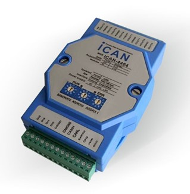

# Woodpecker 
## Accelerator controller


Accelerator controller PILOT ICAN is based on ICAN-4404 4-channel isolated analog output module.



Accelerator module's function is to convert CAN messages to analog signal - voltage from 0-5 V necessary for motor controllers.
Module is configured to operatro on 500Kbps baudrate.

In order to start operations of module CAN message: 
0x00  01 01 00 00 00 00 00 00 should be sent
The message is used in: https://github.com/OSU-LSEV/Mule-EV/blob/main/PWM_CAN_gateway/Woodpecker_PWM_CAN_GTW_Oregon/Woodpecker_PWM_CAN_GTW_Oregon.ino

Mapping of important CAN commandes from CAN .dbc files : https://github.com/OSU-LSEV/Mule-EV/blob/main/CAN_docs/ican_4404_Woodpecker_Oregon.DBF
```
AcceleratorFeedback   0x701
Throttle_Status		  0x161
CommandThrottle		  0x201
Throttle Init Message 0x00
```
Calculations of voltage vs CAN DEC to HEX messages are here: https://bitbucket.org/pilotautomotive/woodpecker-detroit-documentation/src/master/Steering_controller/RC_PWM_CAN_conversions_Detroit.xlsx
The final predifined messages from https://bitbucket.org/pilotautomotive/woodpecker-detroit-documentation/src/master/PWM_CAN_gateway/Woodpecker_PWM_CAN_GTW_Detroit/Woodpecker_PWM_CAN_GTW_Detroit.ino remote control look like:
```
unsigned char accel0[8] = {0x00, 0x00, 0x00, 0x00, 0x00, 0x00, 0x00, 0x00};
unsigned char accel1[8] = {0x2E, 0x00, 0x00, 0x00, 0x00, 0x00, 0x00, 0x00};
unsigned char accel2[8] = {0x5C, 0x00, 0x00, 0x00, 0x00, 0x00, 0x00, 0x00};
unsigned char accel3[8] = {0x8A, 0x00, 0x00, 0x00, 0x00, 0x00, 0x00, 0x00};
unsigned char accel4[8] = {0xB8, 0x00, 0x00, 0x00, 0x00, 0x00, 0x00, 0x00};
unsigned char accel5[8] = {0xE6, 0x00, 0x00, 0x00, 0x00, 0x00, 0x00, 0x00};
unsigned char accel6[8] = {0x14, 0x01, 0x00, 0x00, 0x00, 0x00, 0x00, 0x00};
unsigned char accel7[8] = {0x42, 0x01, 0x00, 0x00, 0x00, 0x00, 0x00, 0x00};
unsigned char accel8[8] = {0x70, 0x01, 0x00, 0x00, 0x00, 0x00, 0x00, 0x00};
unsigned char accel9[8] = {0x9E, 0x01, 0x00, 0x00, 0x00, 0x00, 0x00, 0x00};
unsigned char accel10[8] = {0xCC, 0x01, 0x00, 0x00, 0x00, 0x00, 0x00, 0x00};
unsigned char accel11[8] = {0xFA, 0x01, 0x00, 0x00, 0x00, 0x00, 0x00, 0x00};
unsigned char accel12[8] = {0x28, 0x02, 0x00, 0x00, 0x00, 0x00, 0x00, 0x00};
unsigned char accel13[8] = {0x56, 0x02, 0x00, 0x00, 0x00, 0x00, 0x00, 0x00};
unsigned char accel14[8] = {0x84, 0x02, 0x00, 0x00, 0x00, 0x00, 0x00, 0x00};
unsigned char accel15[8] = {0xB2, 0x02, 0x00, 0x00, 0x00, 0x00, 0x00, 0x00};
unsigned char accel16[8] = {0xE0, 0x02, 0x00, 0x00, 0x00, 0x00, 0x00, 0x00};
unsigned char accel17[8] = {0x0E, 0x03, 0x00, 0x00, 0x00, 0x00, 0x00, 0x00};
unsigned char accel18[8] = {0x3C, 0x03, 0x00, 0x00, 0x00, 0x00, 0x00, 0x00};
unsigned char accel19[8] = {0x6A, 0x03, 0x00, 0x00, 0x00, 0x00, 0x00, 0x00};
unsigned char accel20[8] = {0x98, 0x03, 0x00, 0x00, 0x00, 0x00, 0x00, 0x00};
unsigned char accel21[8] = {0xC6, 0x03, 0x00, 0x00, 0x00, 0x00, 0x00, 0x00};
unsigned char accel22[8] = {0xF4, 0x03, 0x00, 0x00, 0x00, 0x00, 0x00, 0x00};
unsigned char accel23[8] = {0x22, 0x04, 0x00, 0x00, 0x00, 0x00, 0x00, 0x00};
unsigned char accel24[8] = {0x50, 0x04, 0x00, 0x00, 0x00, 0x00, 0x00, 0x00};
unsigned char accel25[8] = {0x7E, 0x04, 0x00, 0x00, 0x00, 0x00, 0x00, 0x00};
unsigned char accel26[8] = {0xAC, 0x04, 0x00, 0x00, 0x00, 0x00, 0x00, 0x00};
unsigned char accel27[8] = {0xDA, 0x04, 0x00, 0x00, 0x00, 0x00, 0x00, 0x00};
unsigned char accel28[8] = {0x08, 0x05, 0x00, 0x00, 0x00, 0x00, 0x00, 0x00};
unsigned char accel29[8] = {0x36, 0x05, 0x00, 0x00, 0x00, 0x00, 0x00, 0x00};
unsigned char accel30[8] = {0x64, 0x05, 0x00, 0x00, 0x00, 0x00, 0x00, 0x00};
unsigned char accel31[8] = {0x92, 0x05, 0x00, 0x00, 0x00, 0x00, 0x00, 0x00};
unsigned char accel32[8] = {0xC0, 0x05, 0x00, 0x00, 0x00, 0x00, 0x00, 0x00};
unsigned char accel33[8] = {0xEE, 0x05, 0x00, 0x00, 0x00, 0x00, 0x00, 0x00};
unsigned char accel34[8] = {0x1C, 0x06, 0x00, 0x00, 0x00, 0x00, 0x00, 0x00};
unsigned char accel35[8] = {0x4A, 0x06, 0x00, 0x00, 0x00, 0x00, 0x00, 0x00};
unsigned char accel36[8] = {0x78, 0x06, 0x00, 0x00, 0x00, 0x00, 0x00, 0x00};
unsigned char accel37[8] = {0xA6, 0x06, 0x00, 0x00, 0x00, 0x00, 0x00, 0x00};
unsigned char accel38[8] = {0xD4, 0x06, 0x00, 0x00, 0x00, 0x00, 0x00, 0x00};
unsigned char accel39[8] = {0x02, 0x07, 0x00, 0x00, 0x00, 0x00, 0x00, 0x00};
unsigned char accel40[8] = {0x30, 0x07, 0x00, 0x00, 0x00, 0x00, 0x00, 0x00};
unsigned char accel41[8] = {0x5E, 0x07, 0x00, 0x00, 0x00, 0x00, 0x00, 0x00};
unsigned char accel42[8] = {0x8C, 0x07, 0x00, 0x00, 0x00, 0x00, 0x00, 0x00};
unsigned char accel43[8] = {0xBA, 0x07, 0x00, 0x00, 0x00, 0x00, 0x00, 0x00};
unsigned char accel44[8] = {0xE8, 0x07, 0x00, 0x00, 0x00, 0x00, 0x00, 0x00};
unsigned char accel45[8] = {0xF8, 0x07, 0x00, 0x00, 0x00, 0x00, 0x00, 0x00};
unsigned char accel46[8] = {0xF8, 0x07, 0x00, 0x00, 0x00, 0x00, 0x00, 0x00};
```

and

```
if (ch2 > 950 && ch2 < 1011){ CAN.sendMsgBuf(0x201, 0, 8, accel1);Serial.println("TH1");}
else if (ch2 > 1012 && ch2 < 1033){ CAN.sendMsgBuf(0x201, 0, 8, accel2);Serial.println("TH2");}
else if (ch2 > 1034 && ch2 < 1055){ CAN.sendMsgBuf(0x201, 0, 8, accel3);Serial.println("TH3");}
else if (ch2 > 1056 && ch2 < 1077){ CAN.sendMsgBuf(0x201, 0, 8, accel4);Serial.println("TH4");}
else if (ch2 > 1078 && ch2 < 1099){ CAN.sendMsgBuf(0x201, 0, 8, accel5);Serial.println("TH5");}
else if (ch2 > 1100 && ch2 < 1121){ CAN.sendMsgBuf(0x201, 0, 8, accel6);Serial.println("TH6");}
else if (ch2 > 1122 && ch2 < 1143){ CAN.sendMsgBuf(0x201, 0, 8, accel7);Serial.println("TH7");}
else if (ch2 > 1144 && ch2 < 1165){ CAN.sendMsgBuf(0x201, 0, 8, accel8);Serial.println("TH8");}
else if (ch2 > 1166 && ch2 < 1187){ CAN.sendMsgBuf(0x201, 0, 8, accel9);Serial.println("TH9");}
else if (ch2 > 1188 && ch2 < 1209){ CAN.sendMsgBuf(0x201, 0, 8, accel10);Serial.println("TH10");}
else if (ch2 > 1210 && ch2 < 1231){ CAN.sendMsgBuf(0x201, 0, 8, accel11);Serial.println("TH11");}
else if (ch2 > 1232 && ch2 < 1253){ CAN.sendMsgBuf(0x201, 0, 8, accel12);Serial.println("TH12");}
else if (ch2 > 1254 && ch2 < 1275){ CAN.sendMsgBuf(0x201, 0, 8, accel13);Serial.println("TH13");}
else if (ch2 > 1276 && ch2 < 1297){ CAN.sendMsgBuf(0x201, 0, 8, accel14);Serial.println("TH14");}
else if (ch2 > 1298 && ch2 < 1319){ CAN.sendMsgBuf(0x201, 0, 8, accel15);Serial.println("TH15");}
else if (ch2 > 1320 && ch2 < 1341){ CAN.sendMsgBuf(0x201, 0, 8, accel16);Serial.println("TH16");}
else if (ch2 > 1342 && ch2 < 1363){ CAN.sendMsgBuf(0x201, 0, 8, accel17);Serial.println("TH17");}
else if (ch2 > 1364 && ch2 < 1385){ CAN.sendMsgBuf(0x201, 0, 8, accel18);Serial.println("TH18");}
else if (ch2 > 1386 && ch2 < 1407){ CAN.sendMsgBuf(0x201, 0, 8, accel19);Serial.println("TH19");}
else if (ch2 > 1408 && ch2 < 1429){ CAN.sendMsgBuf(0x201, 0, 8, accel20);Serial.println("TH20");}
else if (ch2 > 1430 && ch2 < 1451){ CAN.sendMsgBuf(0x201, 0, 8, accel21);Serial.println("TH21");}
else if (ch2 > 1452 && ch2 < 1473){ CAN.sendMsgBuf(0x201, 0, 8, accel22);Serial.println("TH22");}
else if (ch2 > 1474 && ch2 < 1495){ CAN.sendMsgBuf(0x201, 0, 8, accel23);Serial.println("TH23");}
else if (ch2 > 1496 && ch2 < 1517){ CAN.sendMsgBuf(0x201, 0, 8, accel24);Serial.println("TH24");}
else if (ch2 > 1518 && ch2 < 1539){ CAN.sendMsgBuf(0x201, 0, 8, accel25);Serial.println("TH25");}
else if (ch2 > 1540 && ch2 < 1561){ CAN.sendMsgBuf(0x201, 0, 8, accel26);Serial.println("TH26");}
else if (ch2 > 1562 && ch2 < 1583){ CAN.sendMsgBuf(0x201, 0, 8, accel27);Serial.println("TH27");}
else if (ch2 > 1584 && ch2 < 1605){ CAN.sendMsgBuf(0x201, 0, 8, accel28);Serial.println("TH28");}
else if (ch2 > 1606 && ch2 < 1627){ CAN.sendMsgBuf(0x201, 0, 8, accel29);Serial.println("TH29");}
else if (ch2 > 1628 && ch2 < 1649){ CAN.sendMsgBuf(0x201, 0, 8, accel30);Serial.println("TH30");}
else if (ch2 > 1650 && ch2 < 1671){ CAN.sendMsgBuf(0x201, 0, 8, accel31);Serial.println("TH31");}
else if (ch2 > 1672 && ch2 < 1693){ CAN.sendMsgBuf(0x201, 0, 8, accel32);Serial.println("TH32");}
else if (ch2 > 1694 && ch2 < 1715){ CAN.sendMsgBuf(0x201, 0, 8, accel33);Serial.println("TH33");}
else if (ch2 > 1716 && ch2 < 1737){ CAN.sendMsgBuf(0x201, 0, 8, accel34);Serial.println("TH34");}
else if (ch2 > 1738 && ch2 < 1759){ CAN.sendMsgBuf(0x201, 0, 8, accel35);Serial.println("TH35");}
else if (ch2 > 1760 && ch2 < 1781){ CAN.sendMsgBuf(0x201, 0, 8, accel36);Serial.println("TH36");}
else if (ch2 > 1782 && ch2 < 1803){ CAN.sendMsgBuf(0x201, 0, 8, accel37);Serial.println("TH37");}
else if (ch2 > 1804 && ch2 < 1825){ CAN.sendMsgBuf(0x201, 0, 8, accel38);Serial.println("TH38");}
else if (ch2 > 1826 && ch2 < 1847){ CAN.sendMsgBuf(0x201, 0, 8, accel39);Serial.println("TH39");}
else if (ch2 > 1848 && ch2 < 1869){ CAN.sendMsgBuf(0x201, 0, 8, accel40);Serial.println("TH40");}
else if (ch2 > 1870 && ch2 < 1891){ CAN.sendMsgBuf(0x201, 0, 8, accel41);Serial.println("TH41");}
else if (ch2 > 1892 && ch2 < 1913){ CAN.sendMsgBuf(0x201, 0, 8, accel42);Serial.println("TH42");}
else if (ch2 > 1914 && ch2 < 1935){ CAN.sendMsgBuf(0x201, 0, 8, accel43);Serial.println("TH43");}
else if (ch2 > 1936 && ch2 < 1957){ CAN.sendMsgBuf(0x201, 0, 8, accel44);Serial.println("TH44");}
else if (ch2 > 1958 && ch2 < 1979){ CAN.sendMsgBuf(0x201, 0, 8, accel45);Serial.println("TH45");}
else if (ch2 > 1980 && ch2 < 2100){ CAN.sendMsgBuf(0x201, 0, 8, accel46);Serial.println("TH46");}
else { CAN.sendMsgBuf(0x201, 0, 8, accel1);Serial.println("Lost_Connection");};
```
