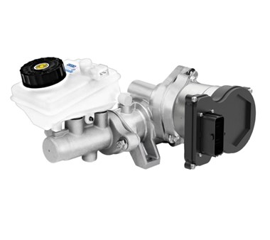

# Woodpecker 
## Brake controller

PILOT DBS or Dynamic Brake System is Drive-by-wire electronic hydraulic brake system



Brake nodule is used to convert CAN message to hydrolic braking power.
Module is configured to operatro on 500Kbps baudrate.


The message is used in: https://github.com/OSU-LSEV/Mule-EV/blob/main/PWM_CAN_gateway/Woodpecker_PWM_CAN_GTW_Oregon/Woodpecker_PWM_CAN_GTW_Oregon.ino

Mapping of important CAN commandes from CAN .dbc files : https://github.com/OSU-LSEV/Mule-EV/blob/main/CAN_docs/Woodpecker_Oregon.DBF  and https://github.com/OSU-LSEV/Mule-EV/blob/main/CAN_docs/DBS3001_231010.dbf 
```
CommandBrake: 0x154
BrakeErrorMessage: 0x143
BrakeStatusMessage: 0x142

```
Calculations of hydrolic power applied vs CAN DEC to HEX messages are here: https://github.com/OSU-LSEV/Mule-EV/blob/main/Brake_controller/DBS_CAN_messages_calculations.xlsx The final predifined messages from https://github.com/OSU-LSEV/Mule-EV/blob/main/PWM_CAN_gateway/Woodpecker_PWM_CAN_GTW_Oregon/Woodpecker_PWM_CAN_GTW_Oregon.ino   remote control look like:
```
unsigned char brake1[8] = {0x01, 0x00, 0x00, 0x00, 0x00, 0x00, 0x00, 0x00};
unsigned char brake2[8] = {0x01, 0x00, 0x05, 0x00, 0x00, 0x00, 0x00, 0x00};
unsigned char brake3[8] = {0x01, 0x00, 0x0A, 0x00, 0x00, 0x00, 0x00, 0x00};
unsigned char brake4[8] = {0x01, 0x00, 0x0F, 0x00, 0x00, 0x00, 0x00, 0x00};
unsigned char brake5[8] = {0x01, 0x00, 0x14, 0x00, 0x00, 0x00, 0x00, 0x00};
unsigned char brake6[8] = {0x01, 0x00, 0x19, 0x00, 0x00, 0x00, 0x00, 0x00};
unsigned char brake7[8] = {0x01, 0x00, 0x1E, 0x00, 0x00, 0x00, 0x00, 0x00};
unsigned char brake8[8] = {0x01, 0x00, 0x23, 0x00, 0x00, 0x00, 0x00, 0x00};
unsigned char brake9[8] = {0x01, 0x00, 0x28, 0x00, 0x00, 0x00, 0x00, 0x00};
unsigned char brake10[8] = {0x01, 0x00, 0x2D, 0x00, 0x00, 0x00, 0x00, 0x00};
unsigned char brake11[8] = {0x01, 0x00, 0x32, 0x00, 0x00, 0x00, 0x00, 0x00};
unsigned char brake12[8] = {0x01, 0x00, 0x37, 0x00, 0x00, 0x00, 0x00, 0x00};
unsigned char brake13[8] = {0x01, 0x00, 0x3C, 0x00, 0x00, 0x00, 0x00, 0x00};
unsigned char brake14[8] = {0x01, 0x00, 0x41, 0x00, 0x00, 0x00, 0x00, 0x00};
unsigned char brake15[8] = {0x01, 0x00, 0x46, 0x00, 0x00, 0x00, 0x00, 0x00};
unsigned char brake16[8] = {0x01, 0x00, 0x4B, 0x00, 0x00, 0x00, 0x00, 0x00};
unsigned char brake17[8] = {0x01, 0x00, 0x50, 0x00, 0x00, 0x00, 0x00, 0x00};
unsigned char brake18[8] = {0x01, 0x00, 0x55, 0x00, 0x00, 0x00, 0x00, 0x00};
unsigned char brake19[8] = {0x01, 0x00, 0x5A, 0x00, 0x00, 0x00, 0x00, 0x00};
unsigned char brake20[8] = {0x01, 0x00, 0x5F, 0x00, 0x00, 0x00, 0x00, 0x00};
unsigned char brake21[8] = {0x01, 0x00, 0x64, 0x00, 0x00, 0x00, 0x00, 0x00};
```

and

```
if (ch8<1550 && ch8>1400){ CAN.sendMsgBuf(0x154, 0, 8, brake1);Serial.println("BR1");};
if (ch8<1399 && ch8>1378){ CAN.sendMsgBuf(0x154, 0, 8, brake2);Serial.println("BR2");};
if (ch8<1377 && ch8>1356){ CAN.sendMsgBuf(0x154, 0, 8, brake3);Serial.println("BR3");};
if (ch8<1355 && ch8>1334){ CAN.sendMsgBuf(0x154, 0, 8, brake4);Serial.println("BR4");};
if (ch8<1333 && ch8>1312){ CAN.sendMsgBuf(0x154, 0, 8, brake5);Serial.println("BR5");};
if (ch8<1311 && ch8>1290){ CAN.sendMsgBuf(0x154, 0, 8, brake6);Serial.println("BR6");};
if (ch8<1289 && ch8>1268){ CAN.sendMsgBuf(0x154, 0, 8, brake7);Serial.println("BR7");};
if (ch8<1267 && ch8>1246){ CAN.sendMsgBuf(0x154, 0, 8, brake8);Serial.println("BR8");};
if (ch8<1245 && ch8>1224){ CAN.sendMsgBuf(0x154, 0, 8, brake9);Serial.println("BR9");};
if (ch8<1223 && ch8>1202){ CAN.sendMsgBuf(0x154, 0, 8, brake10);Serial.println("BR10");};
if (ch8<1201 && ch8>1180){ CAN.sendMsgBuf(0x154, 0, 8, brake11);Serial.println("BR11");};
if (ch8<1179 && ch8>1158){ CAN.sendMsgBuf(0x154, 0, 8, brake12);Serial.println("BR12");};
if (ch8<1157 && ch8>1136){ CAN.sendMsgBuf(0x154, 0, 8, brake13);Serial.println("BR13");};
if (ch8<1135 && ch8>1114){ CAN.sendMsgBuf(0x154, 0, 8, brake14);Serial.println("BR14");};
if (ch8<1113 && ch8>1092){ CAN.sendMsgBuf(0x154, 0, 8, brake15);Serial.println("BR15");};
if (ch8<1091 && ch8>1070){ CAN.sendMsgBuf(0x154, 0, 8, brake16);Serial.println("BR16");};
if (ch8<1069 && ch8>1048){ CAN.sendMsgBuf(0x154, 0, 8, brake17);Serial.println("BR17");};
if (ch8<1047 && ch8>1026){ CAN.sendMsgBuf(0x154, 0, 8, brake18);Serial.println("BR18");};
if (ch8<1025 && ch8>1004){ CAN.sendMsgBuf(0x154, 0, 8, brake19);Serial.println("BR19");};
if (ch8<1003 && ch8>982){ CAN.sendMsgBuf(0x154, 0, 8, brake20);Serial.println("BR20");};
if (ch8<981 && ch8>980){ CAN.sendMsgBuf(0x154, 0, 8, brake21);Serial.println("BR21");};
```
