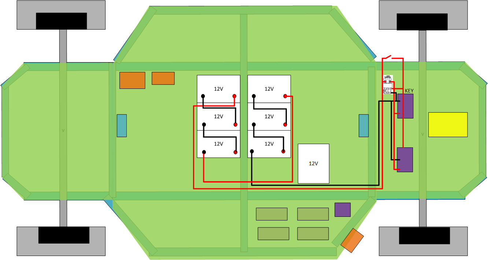
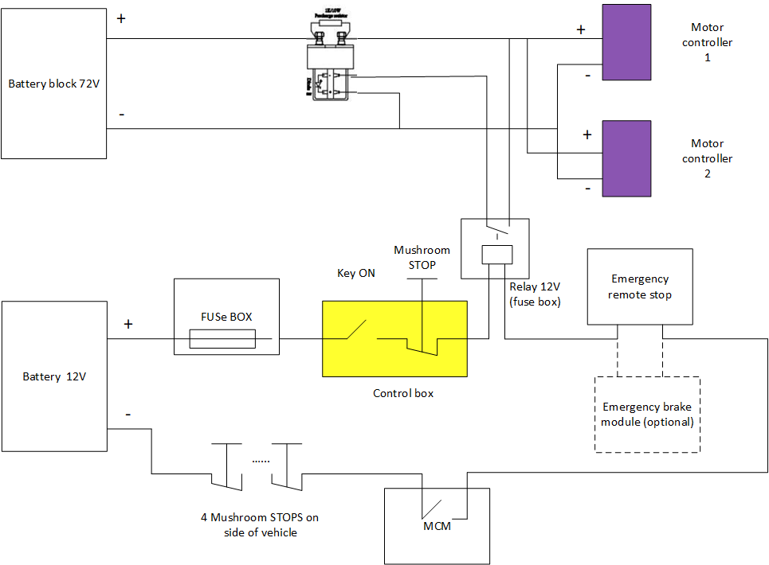
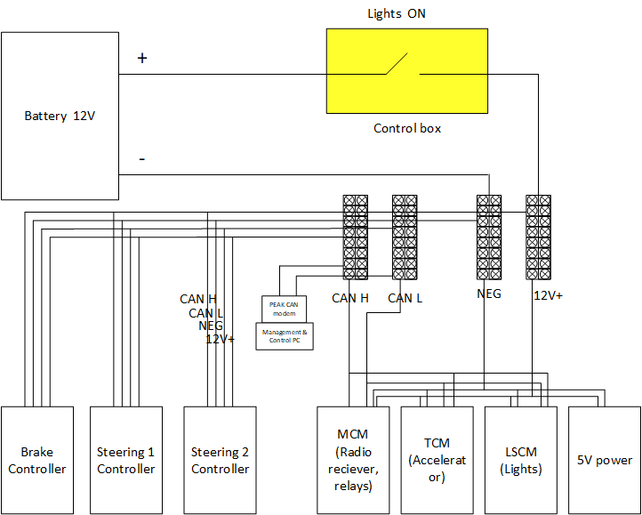
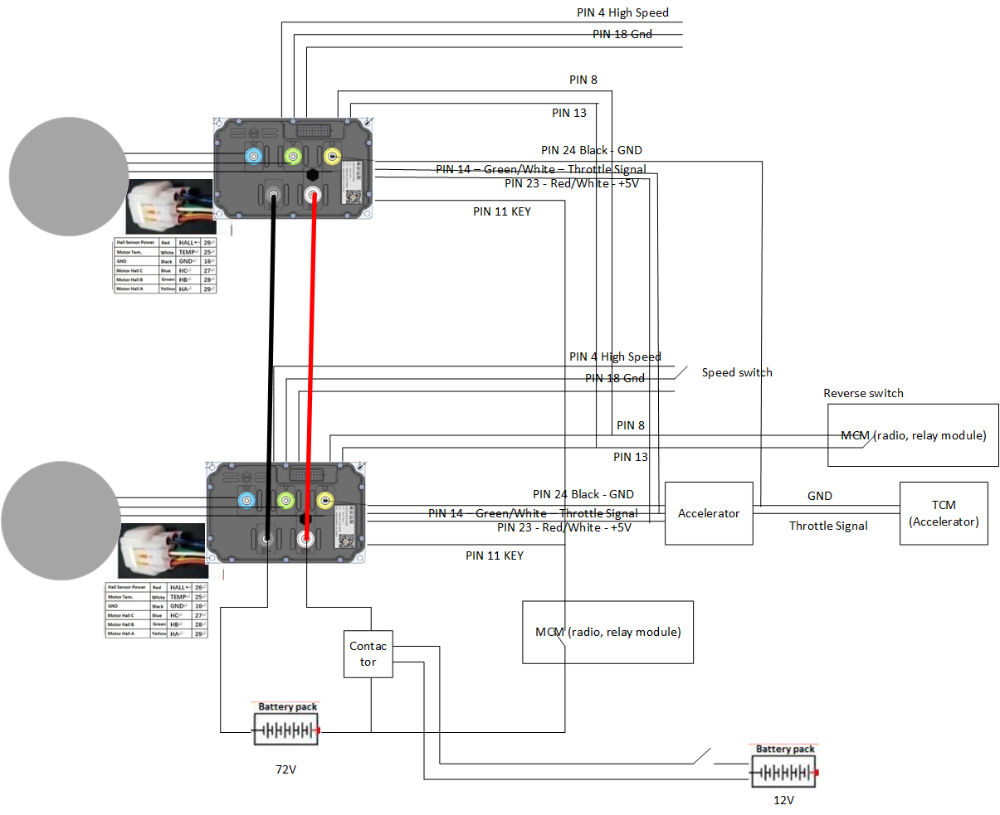
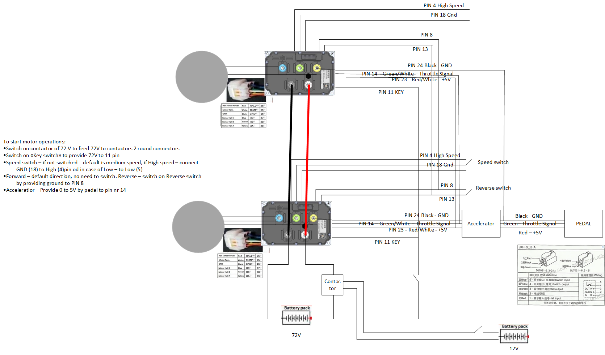
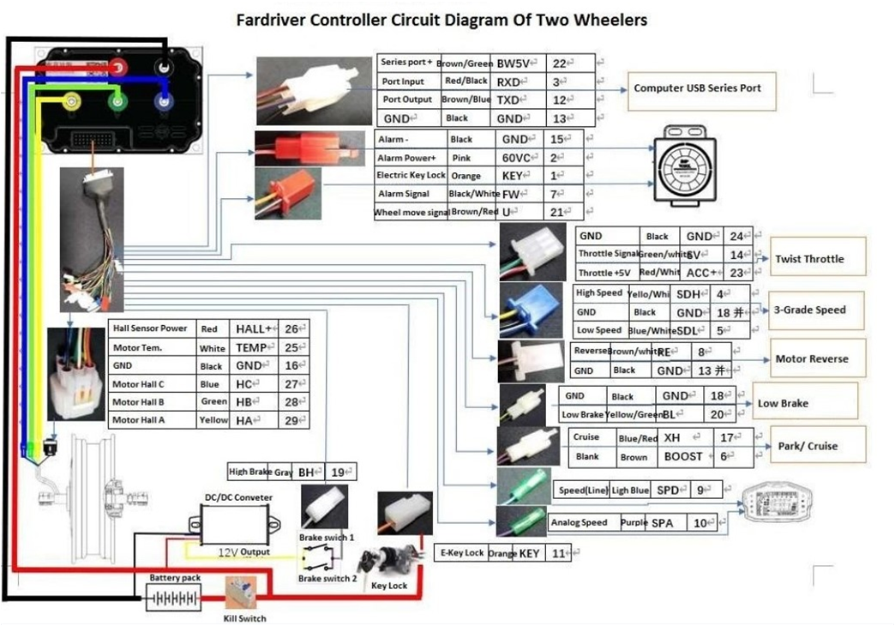

# Woodpecker 
## Electrical diagramms

### Accumulator batteries and 72V section:

### 72V and 12V connections: 

### CAN and 12V networks: 

### Motor Controller diagramm: 

### Motor controller diagremm for tests:
 

### Motor controller connection diagramm: 

