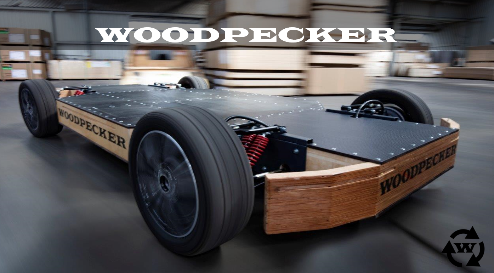
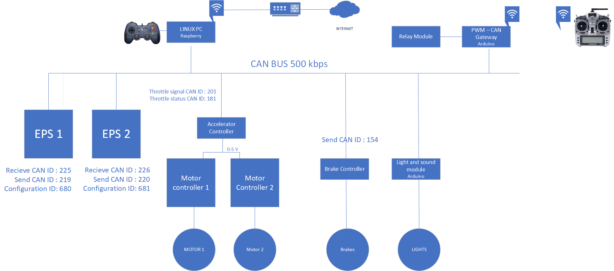
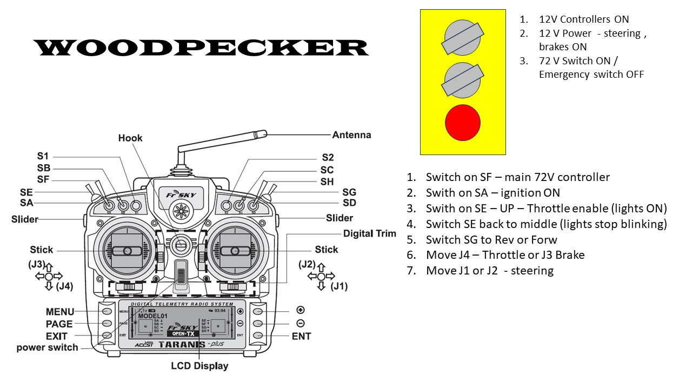
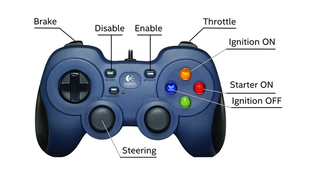
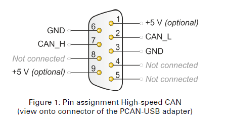

# Mule-EV
Modified iteration of the woodpecker EV platform 


# Woodpecker 
## Design documentation and Operating Manual
The main information backboan is CAN bus.



# Operation
There are 2 operating modes: manual and DbW mode. 
Wireless operations:



## Switching ON DbW mode

1. Switch DbW ON switch on front panel. Red signal light must light on. [Make sure mushroom Emergency STOP is released]
2. Wait for 30-50 sec to boot up Joystick micro computer. Joystick demo application should startup automatically.
3. Press START on joystick controller [Should hear clicking noise of controller relays] to enable controller.
4. Press Y to switch on ignition. Wait for 2-3 sec.
5. Press B to start starter.
6. Use joystick controls to drive, manually switch into high or low gear.


# Main DbW components.

Drive By Wire system consists from:

**1. Accelerator Controller**

Connected to motor controller. Receive commands and provide report via DbW CAN messages. Located in Rigt side. 

**2. Brake Controller.**

Connected to hydraulic brake unit. Receive commands and provide report via DbW CAN messages. Located in Middle

**3. Control Processor.**

Control processor is connected to DbW CAN network and 4 relay block and 2 push button switches to provide Engine ON, OFF and override functionality. Located in Right side 

**4. Joystick micro computer**

Raspberry Pi micro computer is located in Right side of vehicle, Logitech F310 gamepad attached via USB port. Connected to DbW CAN and LAN port on front panel. Joystick sample application is located on microcomputer dir /home/pi/Razor .
Bash script fro automatic joystick launch is located @ /home/pi/dbwstart.sh
Script is being launched on bootup from config file /etc/rc.local

content of .dbstart.sh script:
```
#!/bin/bash

sudo ip link set can0 type can bitrate 500000
sudo ip link set up can0
sudo ip link set can1 type can bitrate 500000
sudo ip link set up can1
cd /home/pi/Razor/build
./oscc-joystick-commander 0
```

Access information:
```
Connect using SSH to 10.0.10.15:22
User: pi
Password: nvidia
```

# CAN buse
There are 1 CAN buses on vehicle. DbW CAN screw terminal is located in Right side.

1. DbW CAN bus. - 500k

Connected devices: Brake controller, Accelerator controller, Steering controller, CAN Gateway, 

# Controls


1. DbW ON - Main Power switch ON/OFF. Power up all controllers. If Switched OFF DbW is disabled, fall back to manual.
2. Emergency STOP - DbW switch off. If pressed, DbW controls disabled, switch back to manual mode. Connected in Parallel with DbW ON switch.
3. LAN Connection - LAN port to connect to Joystick micro computer.
4. Power Steer ON - Button to force steering unit to switch ON power assist mode.

## Joystick operation


```
START - Enable controls
BACK - Disable controls
LEFT TRIGGER - Brake
RIGHT TRIGGER - Throttle
LEFT STICK - Steering
Y - Ignition ON
X - Ignition OFF
B - Starter ON
```
## CAN Modem

System is using PEAK CAN USB modem.
Drivers are available from Peak Systems website : https://www.peak-system.com/PCAN-USB.199.0.html?L=1# 
Connection port connector is located in the front panel of 
Pin out diagram is here:



# Operation from management computer with joystick application:

In order to start operations of DbW:

1.	Switch main power switch On.
2.	Wait 1-2 min to start all processors.
3.	Initiate joystick controller (for test mode only). Connect to DbW GW controller from management PC:
a.	Launch Putty;
b.	Enter SSH connection to 10.0.10.15 
c.	Launch 1st  test window to monitor accelerator/braking signal:
d.	Enter username : pi
e.	Enter password: nvidia

```
cd /home/pi/can-utils
./candump can1
```
f.	As result the realtime changing data should appear:
```
  can1  061   [8]  05 CC 01 00 00 0F 00 01
  can1  063   [8]  05 CC 01 00 00 F2 08 08
  can1  061   [8]  05 CC 01 00 00 0F 00 01
  can1  063   [8]  05 CC 01 00 00 40 02 06
```

If there are no realtime data – DbW CAN interface is down, See troubleshooting.


k.	Launch 2nd Putty Window for joystick commander: 
cd /home/pi/Razor/build
./oscc-joystick-commander 0       

l.	There should be visible initiating screen – similar to: 
```
Opening EPAS CAN channel: can0
Opening CAN channel: can1
Found 1 devices -- connecting to device at system index 0 - GUID:030000006d0400001dc2000014400000
Waiting for joystick controls to zero
Joystick controls successfully initialized

Control Ready:
    START - Enable controls
    BACK - Disable controls
    LEFT TRIGGER - Brake
    RIGHT TRIGGER - Throttle
    LEFT STICK - Steering
```
m.	Press “START” to Enable controls, press “BACK” to Disable controls
n.	Controls on Joystick:     LEFT TRIGGER – Brake; RIGHT TRIGGER – Throttle ; LEFT STICK - Steering
o.	Typical view of DbW interface:
```
Brake: 0.000000 Throttle: 0.950990 Steering bytes: 0000
Brake: 0.000000 Throttle: 0.920007 Steering bytes: 0000
```
4.	Switch on ignition.
5.  Start the Engine
5.	Manually switch in to gear
7.	Start driving with joystick control


