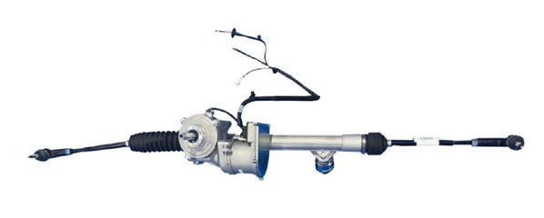

# Woodpecker 
## Steering controller

PILOT SBW2 EPS is Drive-by-wire electric power steering (EPS) system




Steering module is used to convert CAN message to steering angle.
Module is configured to operate on 500Kbps baudrate.


The message is used in: https://bitbucket.org/pilotautomotive/woodpecker-detroit-documentation/src/master/PWM_CAN_gateway/Woodpecker_PWM_CAN_GTW_Detroit/Woodpecker_PWM_CAN_GTW_Detroit.ino

Mapping of important CAN commandes from CAN .dbc files : https://bitbucket.org/pilotautomotive/woodpecker-detroit-documentation/src/master/CAN_docs/Woodpecker_Detroit.DBF  
```
StatusEPS1: 0x225
StatusEPS2: 0x226
CommandEPS1: 0x219
CommandEPS2: 0x220

```
Calculations of steering applied as CAN DEC to HEX messages are here: https://bitbucket.org/pilotautomotive/woodpecker-detroit-documentation/src/master/Steering_controller/EPS_CAN_messages_calculation.xlsx and here https://bitbucket.org/pilotautomotive/woodpecker-detroit-documentation/src/master/Steering_controller/Steering_joystick_commands.xlsx
The final predifined messages from https://bitbucket.org/pilotautomotive/woodpecker-detroit-documentation/src/master/PWM_CAN_gateway/Woodpecker_PWM_CAN_GTW_Detroit/Woodpecker_PWM_CAN_GTW_Detroit.ino remote control look like:
```
unsigned char steer20[8] = {0x40, 0xFA, 0xCF, 0x39, 0x00, 0x00, 0x00, 0x00};
unsigned char steer19[8] = {0x40, 0xFA, 0x71, 0x38, 0x00, 0x00, 0x00, 0x00};
unsigned char steer18[8] = {0x40, 0xFA, 0x13, 0x37, 0x00, 0x00, 0x00, 0x00};
unsigned char steer17[8] = {0x40, 0xFA, 0xB5, 0x35, 0x00, 0x00, 0x00, 0x00};
unsigned char steer16[8] = {0x40, 0xFA, 0x57, 0x34, 0x00, 0x00, 0x00, 0x00};
unsigned char steer15[8] = {0x40, 0xFA, 0xF9, 0x32, 0x00, 0x00, 0x00, 0x00};
unsigned char steer14[8] = {0x40, 0xFA, 0x9B, 0x31, 0x00, 0x00, 0x00, 0x00};
unsigned char steer13[8] = {0x40, 0xFA, 0x3D, 0x30, 0x00, 0x00, 0x00, 0x00};
unsigned char steer12[8] = {0x40, 0xFA, 0xDF, 0x2E, 0x00, 0x00, 0x00, 0x00};
unsigned char steer11[8] = {0x40, 0xFA, 0x81, 0x2D, 0x00, 0x00, 0x00, 0x00};
unsigned char steer10[8] = {0x40, 0xFA, 0x23, 0x2C, 0x00, 0x00, 0x00, 0x00};
unsigned char steer9[8] = {0x40, 0xFA, 0xC5, 0x2A, 0x00, 0x00, 0x00, 0x00};
unsigned char steer8[8] = {0x40, 0xFA, 0x67, 0x29, 0x00, 0x00, 0x00, 0x00};
unsigned char steer7[8] = {0x40, 0xFA, 0x09, 0x28, 0x00, 0x00, 0x00, 0x00};
unsigned char steer6[8] = {0x40, 0xFA, 0xAB, 0x26, 0x00, 0x00, 0x00, 0x00};
unsigned char steer5[8] = {0x40, 0xFA, 0x4D, 0x25, 0x00, 0x00, 0x00, 0x00};
unsigned char steer4[8] = {0x40, 0xFA, 0xEF, 0x23, 0x00, 0x00, 0x00, 0x00};
unsigned char steer3[8] = {0x40, 0xFA, 0x91, 0x22, 0x00, 0x00, 0x00, 0x00};
unsigned char steer2[8] = {0x40, 0xFA, 0x33, 0x21, 0x00, 0x00, 0x00, 0x00};
unsigned char steer1[8] = {0x40, 0xFA, 0xD5, 0x1F, 0x00, 0x00, 0x00, 0x00};
unsigned char steer0[8] = {0x40, 0xFA, 0x77, 0x1E, 0x00, 0x00, 0x00, 0x00};
unsigned char steern1[8] = {0x40, 0xFA, 0x19, 0x1D, 0x00, 0x00, 0x00, 0x00};
unsigned char steern2[8] = {0x40, 0xFA, 0xBB, 0x1B, 0x00, 0x00, 0x00, 0x00};
unsigned char steern3[8] = {0x40, 0xFA, 0x5D, 0x1A, 0x00, 0x00, 0x00, 0x00};
unsigned char steern4[8] = {0x40, 0xFA, 0xFF, 0x18, 0x00, 0x00, 0x00, 0x00};
unsigned char steern5[8] = {0x40, 0xFA, 0xA1, 0x17, 0x00, 0x00, 0x00, 0x00};
unsigned char steern6[8] = {0x40, 0xFA, 0x43, 0x16, 0x00, 0x00, 0x00, 0x00};
unsigned char steern7[8] = {0x40, 0xFA, 0xE5, 0x14, 0x00, 0x00, 0x00, 0x00};
unsigned char steern8[8] = {0x40, 0xFA, 0x87, 0x13, 0x00, 0x00, 0x00, 0x00};
unsigned char steern9[8] = {0x40, 0xFA, 0x29, 0x12, 0x00, 0x00, 0x00, 0x00};
unsigned char steern10[8] = {0x40, 0xFA, 0xCB, 0x10, 0x00, 0x00, 0x00, 0x00};
unsigned char steern11[8] = {0x40, 0xFA, 0x6D, 0x0F, 0x00, 0x00, 0x00, 0x00};
unsigned char steern12[8] = {0x40, 0xFA, 0x0F, 0x0E, 0x00, 0x00, 0x00, 0x00};
unsigned char steern13[8] = {0x40, 0xFA, 0xB1, 0x0C, 0x00, 0x00, 0x00, 0x00};
unsigned char steern14[8] = {0x40, 0xFA, 0x53, 0x0B, 0x00, 0x00, 0x00, 0x00};
unsigned char steern15[8] = {0x40, 0xFA, 0xF5, 0x09, 0x00, 0x00, 0x00, 0x00};
unsigned char steern16[8] = {0x40, 0xFA, 0x97, 0x08, 0x00, 0x00, 0x00, 0x00};
unsigned char steern17[8] = {0x40, 0xFA, 0x38, 0x07, 0x00, 0x00, 0x00, 0x00};
unsigned char steern18[8] = {0x40, 0xFA, 0xDA, 0x05, 0x00, 0x00, 0x00, 0x00};
unsigned char steern19[8] = {0x40, 0xFA, 0x7C, 0x04, 0x00, 0x00, 0x00, 0x00};
unsigned char steern20[8] = {0x40, 0xFA, 0x1E, 0x03, 0x00, 0x00, 0x00, 0x00};
```

and

```
if (ch1 > 980 && ch1 < 1105) {CAN.sendMsgBuf(0x219, 0, 8, steern20);Serial.println(-20);};
  if (ch1 > 1106 && ch1 < 1125) {CAN.sendMsgBuf(0x219, 0, 8, steern19);Serial.println(-19);};
  if (ch1 > 1126 && ch1 < 1145) {CAN.sendMsgBuf(0x219, 0, 8, steern18);Serial.println(-18);};
  if (ch1 > 1146 && ch1 < 1165) {CAN.sendMsgBuf(0x219, 0, 8, steern17);Serial.println(-17);};
  if (ch1 > 1166 && ch1 < 1185) {CAN.sendMsgBuf(0x219, 0, 8, steern16);Serial.println(-16);};
  if (ch1 > 1186 && ch1 < 1205) {CAN.sendMsgBuf(0x219, 0, 8, steern15);Serial.println(-15);};
  if (ch1 > 1206 && ch1 < 1225) {CAN.sendMsgBuf(0x219, 0, 8, steern14);Serial.println(-14);};
  if (ch1 > 1226 && ch1 < 1245) {CAN.sendMsgBuf(0x219, 0, 8, steern13);Serial.println(-13);};
  if (ch1 > 1246 && ch1 < 1265) {CAN.sendMsgBuf(0x219, 0, 8, steern12);Serial.println(-12);};
  if (ch1 > 1266 && ch1 < 1285) {CAN.sendMsgBuf(0x219, 0, 8, steern11);Serial.println(-11);};
  if (ch1 > 1286 && ch1 < 1305) {CAN.sendMsgBuf(0x219, 0, 8, steern10);Serial.println(-10);};
  if (ch1 > 1306 && ch1 < 1325) {CAN.sendMsgBuf(0x219, 0, 8, steern9);Serial.println(-9);};
  if (ch1 > 1326 && ch1 < 1345) {CAN.sendMsgBuf(0x219, 0, 8, steern8);Serial.println(-8);};
  if (ch1 > 1346 && ch1 < 1365) {CAN.sendMsgBuf(0x219, 0, 8, steern7);Serial.println(-7);};
  if (ch1 > 1366 && ch1 < 1385) {CAN.sendMsgBuf(0x219, 0, 8, steern6);Serial.println(-6);};
  if (ch1 > 1386 && ch1 < 1405) {CAN.sendMsgBuf(0x219, 0, 8, steern5);Serial.println(-5);};
  if (ch1 > 1406 && ch1 < 1425) {CAN.sendMsgBuf(0x219, 0, 8, steern4);Serial.println(-4);};
  if (ch1 > 1426 && ch1 < 1445) {CAN.sendMsgBuf(0x219, 0, 8, steern3);Serial.println(-3);};
  if (ch1 > 1446 && ch1 < 1465) {CAN.sendMsgBuf(0x219, 0, 8, steern2);Serial.println(-2);};
  if (ch1 > 1466 && ch1 < 1479) {CAN.sendMsgBuf(0x219, 0, 8, steer0);Serial.println(-1);};
  if (ch1 > 1480 && ch1 < 1505) {CAN.sendMsgBuf(0x219, 0, 8, steer0);Serial.println(0);};
  if (ch1 > 1506 && ch1 < 1525) {CAN.sendMsgBuf(0x219, 0, 8, steer0);Serial.println(1);};
  if (ch1 > 1526 && ch1 < 1545) {CAN.sendMsgBuf(0x219, 0, 8, steer2);Serial.println(2);};
  if (ch1 > 1546 && ch1 < 1565) {CAN.sendMsgBuf(0x219, 0, 8, steer3);Serial.println(3);};
  if (ch1 > 1566 && ch1 < 1585) {CAN.sendMsgBuf(0x219, 0, 8, steer4);Serial.println(4);};
  if (ch1 > 1586 && ch1 < 1605) {CAN.sendMsgBuf(0x219, 0, 8, steer5);Serial.println(5);};
  if (ch1 > 1606 && ch1 < 1625) {CAN.sendMsgBuf(0x219, 0, 8, steer6);Serial.println(6);};
  if (ch1 > 1626 && ch1 < 1645) {CAN.sendMsgBuf(0x219, 0, 8, steer7);Serial.println(7);};
  if (ch1 > 1646 && ch1 < 1665) {CAN.sendMsgBuf(0x219, 0, 8, steer8);Serial.println(8);};
  if (ch1 > 1666 && ch1 < 1685) {CAN.sendMsgBuf(0x219, 0, 8, steer9);Serial.println(9);};
  if (ch1 > 1686 && ch1 < 1705) {CAN.sendMsgBuf(0x219, 0, 8, steer10);Serial.println(10);};
  if (ch1 > 1706 && ch1 < 1725) {CAN.sendMsgBuf(0x219, 0, 8, steer11);Serial.println(11);};
  if (ch1 > 1726 && ch1 < 1745) {CAN.sendMsgBuf(0x219, 0, 8, steer12);Serial.println(12);};
  if (ch1 > 1746 && ch1 < 1765) {CAN.sendMsgBuf(0x219, 0, 8, steer13);Serial.println(13);};
  if (ch1 > 1766 && ch1 < 1785) {CAN.sendMsgBuf(0x219, 0, 8, steer14);Serial.println(14);};
  if (ch1 > 1786 && ch1 < 1805) {CAN.sendMsgBuf(0x219, 0, 8, steer15);Serial.println(15);};
  if (ch1 > 1806 && ch1 < 1825) {CAN.sendMsgBuf(0x219, 0, 8, steer16);Serial.println(16);};
  if (ch1 > 1826 && ch1 < 1845) {CAN.sendMsgBuf(0x219, 0, 8, steer17);Serial.println(17);};
  if (ch1 > 1846 && ch1 < 1865) {CAN.sendMsgBuf(0x219, 0, 8, steer18);Serial.println(18);};
  if (ch1 > 1866 && ch1 < 1885) {CAN.sendMsgBuf(0x219, 0, 8, steer19);Serial.println(19);};
  if (ch1 > 1886 && ch1 < 2005) {CAN.sendMsgBuf(0x219, 0, 8, steer19);Serial.println(20);};

if (ch3 > 1000 && ch3 < 1189) CAN.sendMsgBuf(0x220, 0, 8, steern20);
if (ch3 > 1190 && ch3 < 1209) CAN.sendMsgBuf(0x220, 0, 8, steern19);
if (ch3 > 1210 && ch3 < 1229) CAN.sendMsgBuf(0x220, 0, 8, steern18);
if (ch3 > 1230 && ch3 < 1249) CAN.sendMsgBuf(0x220, 0, 8, steern17);
if (ch3 > 1250 && ch3 < 1269) CAN.sendMsgBuf(0x220, 0, 8, steern16);
if (ch3 > 1270 && ch3 < 1289) CAN.sendMsgBuf(0x220, 0, 8, steern15);
if (ch3 > 1290 && ch3 < 1309) CAN.sendMsgBuf(0x220, 0, 8, steern14);
if (ch3 > 1310 && ch3 < 1329) CAN.sendMsgBuf(0x220, 0, 8, steern13);
if (ch3 > 1330 && ch3 < 1349) CAN.sendMsgBuf(0x220, 0, 8, steern12);
if (ch3 > 1350 && ch3 < 1369) CAN.sendMsgBuf(0x220, 0, 8, steern11);
if (ch3 > 1370 && ch3 < 1389) CAN.sendMsgBuf(0x220, 0, 8, steern10);
if (ch3 > 1390 && ch3 < 1409) CAN.sendMsgBuf(0x220, 0, 8, steern9);
if (ch3 > 1410 && ch3 < 1429) CAN.sendMsgBuf(0x220, 0, 8, steern8);
if (ch3 > 1430 && ch3 < 1449) CAN.sendMsgBuf(0x220, 0, 8, steern7);
if (ch3 > 1450 && ch3 < 1469) CAN.sendMsgBuf(0x220, 0, 8, steern6);
if (ch3 > 1470 && ch3 < 1489) CAN.sendMsgBuf(0x220, 0, 8, steern5);
if (ch3 > 1490 && ch3 < 1509) CAN.sendMsgBuf(0x220, 0, 8, steern4);
if (ch3 > 1510 && ch3 < 1529) CAN.sendMsgBuf(0x220, 0, 8, steern3);
if (ch3 > 1530 && ch3 < 1549) CAN.sendMsgBuf(0x220, 0, 8, steern2);
if (ch3 > 1550 && ch3 < 1569) CAN.sendMsgBuf(0x220, 0, 8, steern1);
if (ch3 > 1570 && ch3 < 1590) CAN.sendMsgBuf(0x220, 0, 8, steer0);
if (ch3 > 1591 && ch3 < 1610) CAN.sendMsgBuf(0x220, 0, 8, steer1);
if (ch3 > 1611 && ch3 < 1630) CAN.sendMsgBuf(0x220, 0, 8, steer2);
if (ch3 > 1631 && ch3 < 1650) CAN.sendMsgBuf(0x220, 0, 8, steer3);
if (ch3 > 1651 && ch3 < 1670) CAN.sendMsgBuf(0x220, 0, 8, steer4);
if (ch3 > 1671 && ch3 < 1690) CAN.sendMsgBuf(0x220, 0, 8, steer5);
if (ch3 > 1691 && ch3 < 1710) CAN.sendMsgBuf(0x220, 0, 8, steer6);
if (ch3 > 1711 && ch3 < 1730) CAN.sendMsgBuf(0x220, 0, 8, steer7);
if (ch3 > 1731 && ch3 < 1750) CAN.sendMsgBuf(0x220, 0, 8, steer8);
if (ch3 > 1751 && ch3 < 1770) CAN.sendMsgBuf(0x220, 0, 8, steer9);
if (ch3 > 1771 && ch3 < 1790) CAN.sendMsgBuf(0x220, 0, 8, steer10);
if (ch3 > 1791 && ch3 < 1810) CAN.sendMsgBuf(0x220, 0, 8, steer11);
if (ch3 > 1811 && ch3 < 1830) CAN.sendMsgBuf(0x220, 0, 8, steer12);
if (ch3 > 1831 && ch3 < 1850) CAN.sendMsgBuf(0x220, 0, 8, steer13);
if (ch3 > 1851 && ch3 < 1870) CAN.sendMsgBuf(0x220, 0, 8, steer14);
if (ch3 > 1871 && ch3 < 1890) CAN.sendMsgBuf(0x220, 0, 8, steer15);
if (ch3 > 1891 && ch3 < 1910) CAN.sendMsgBuf(0x220, 0, 8, steer16);
if (ch3 > 1911 && ch3 < 1930) CAN.sendMsgBuf(0x220, 0, 8, steer17);
if (ch3 > 1931 && ch3 < 1950) CAN.sendMsgBuf(0x220, 0, 8, steer18);
if (ch3 > 1951 && ch3 < 2010) CAN.sendMsgBuf(0x220, 0, 8, steer19);
```

